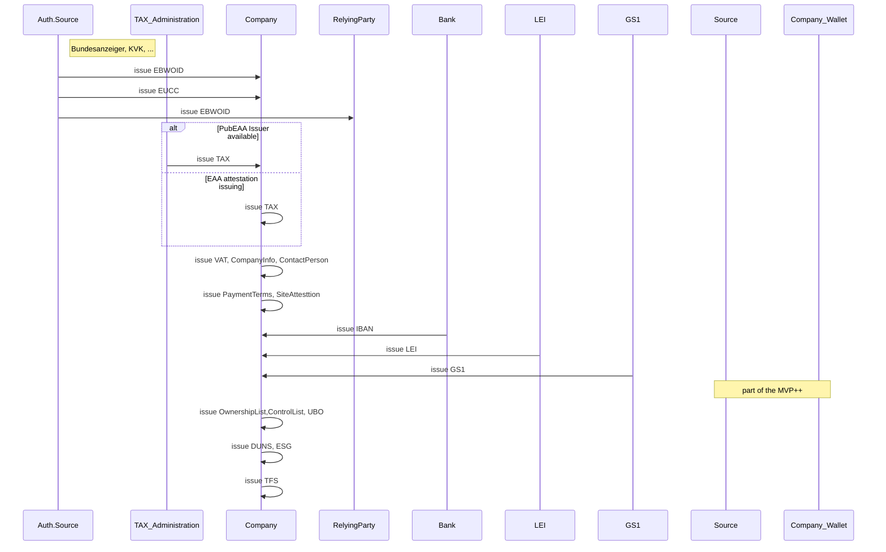
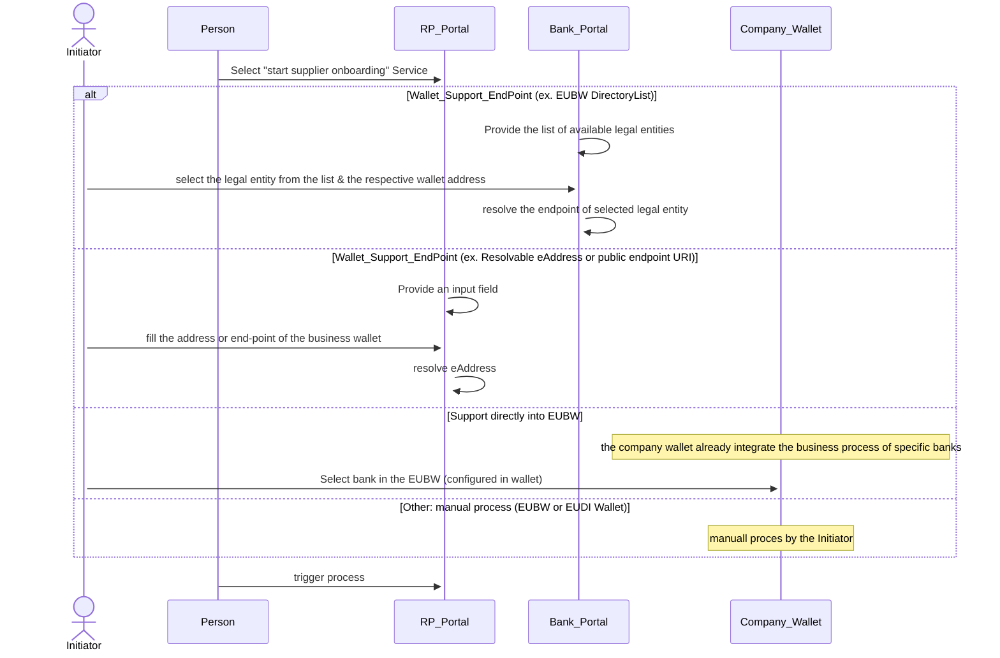
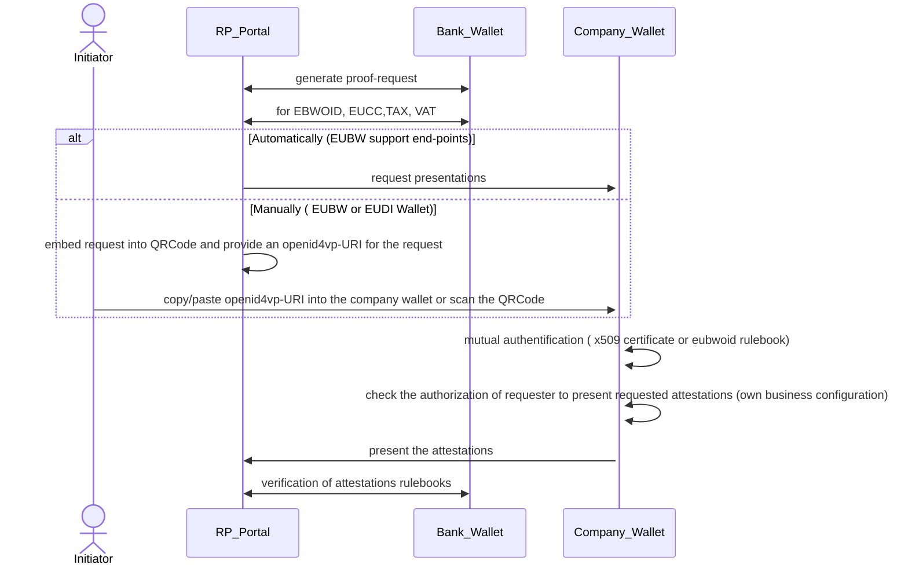
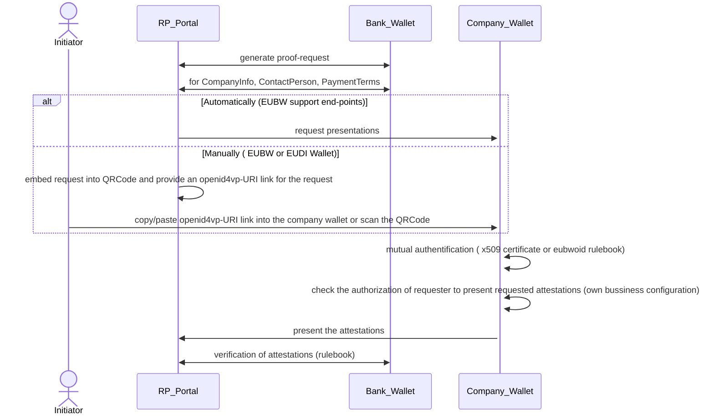
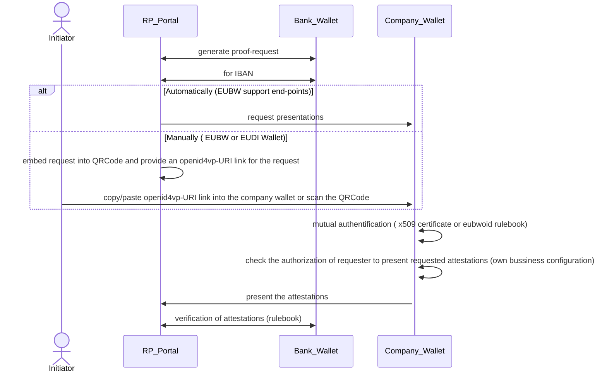
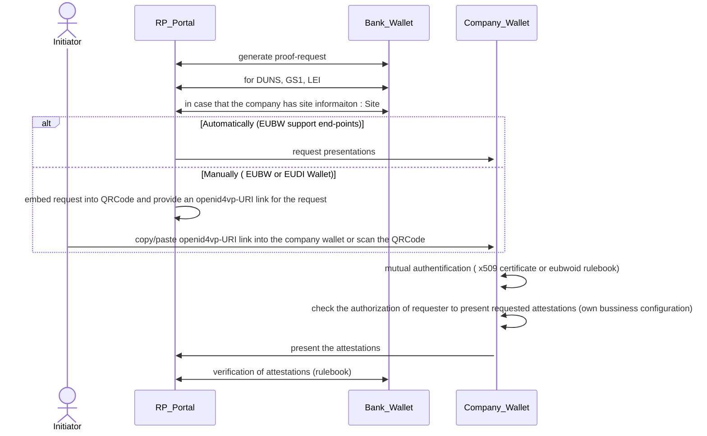
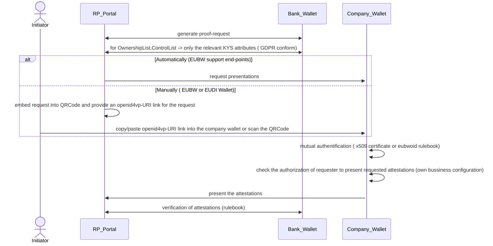
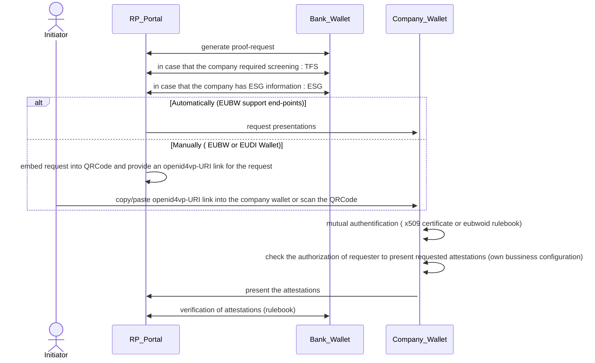
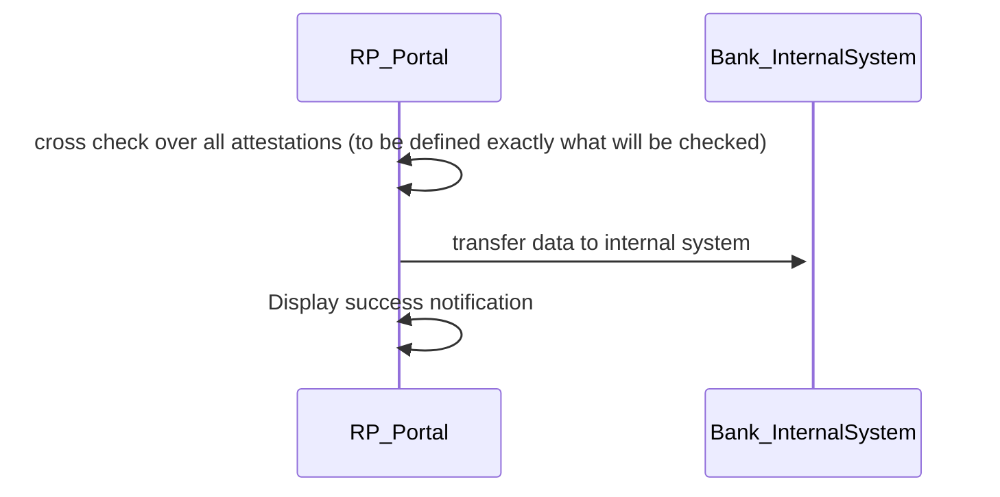

# BU1 KYS MVP Workflow

MVP Restrictions:
## Company Perspective
- Any person can trigger the process of supplier onboarding
- The company is authorized to present attestations and receive attestations (no configuration support)
- Mutual authentication is set to default true (no TLOL or device-binding checks are applied).
- The MVP process is executed sequentially in one step. 

## RelyingParty perspective
- The company who wants to be supplier will be classified as low/medium risk supplier. It will be no high-risk supplier  (therefore, e.g.: no sanction screening is required)

MVP+ Extension:
## RelyingParty perspective
- Additionally support for the KYS due diligence
- Additionally support for the sanction list validation 
- Additionally support for the ESG Cetificates 

## Pre-requisites
This are the pre-requisites for the company in order to run the MVP.

### 1. Scenario KYC 

### 1.1. Legal Entity Selection

### 1.2. LegalEntity Identification 

### 1.3. KYS - Base Information 

### 1.4. KYS - Payment Information

### 1.5. KYS - Additionally identifier Information  

### 1.6. KYS - CDD Information  (this will be handled in the MVP+)

### 1.7. Additionally KYS Information - relevant in Screening process (this will be handled in the MVP+)

### 1.8. Cross-Check  

