# PA3 MVP+ Workflow

MVP+ coverage

## Scenario 1
- Initiator - not registered in any registry (no EUCC)
- min 2 Legal Representatives one  Legal Representative registered in EUCC and one Legal Representative with POA only 
- min 2 UBOs: UBO 1 registered in transparency register and EUCC  and UBO 2 not registered in transparency register (“fictive UBO”)
- UBO identification & verification (online,offline and videoident) 
- UBO 1: offline onboarding (no EUDI wallet, POA + supporting evidence)
- UBO 2: offline onboarding (no EUDI wallet, VideoIdent)
- Support for cross-border onboarding with registration in the national register
- The company operates as a branch in another country

## Scenario 2
- Default signing method: QES Minimum of 2 signatories required : one  Legal Representative and one person with POA
Open point:
- Assessment required whether QSeal alone is sufficient for contract signing (@Stephan to check )

## Scenario 3
Open point:
- Definition and detailed design of the onboarding process for authorized persons
- The process is executed in 2 steps ( (@Ricky to fill in)
- IBAN-OV issuance/attestation as QEAA

## Pre-requisites
This are the Pre-requisites for the company and bank in order to run the MVP.

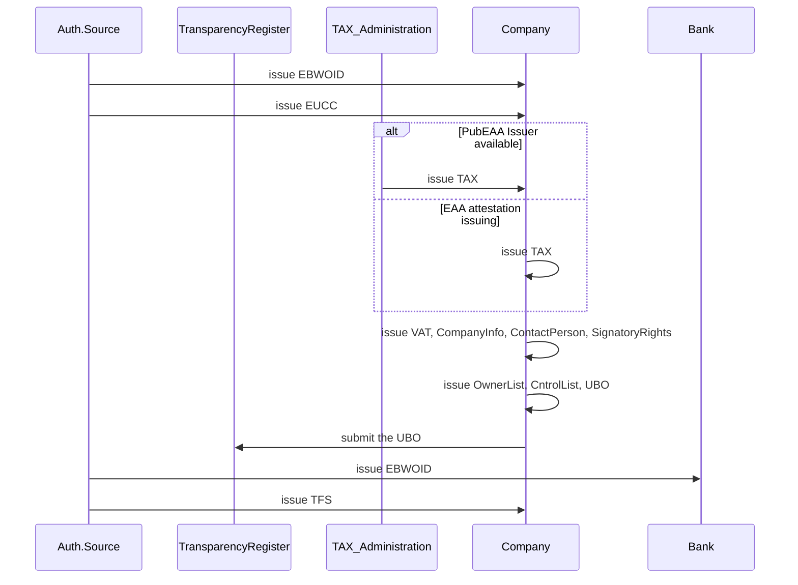

### 1. Scenario 1

### 1.1. Legal Entity Selection
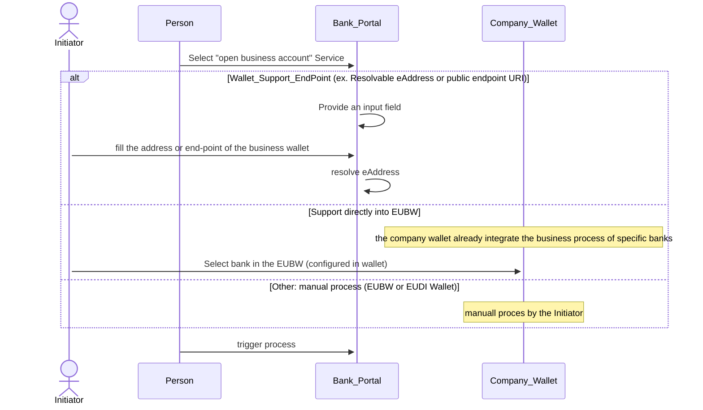

### 1.2. Initiator Identification
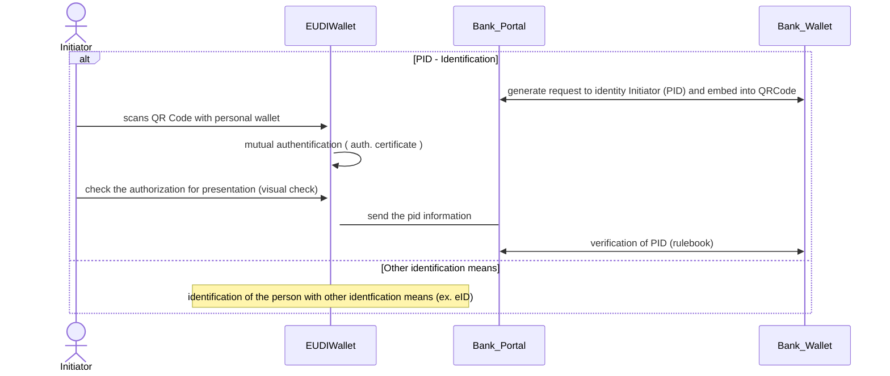

### 1.3. LegalEntity Identification

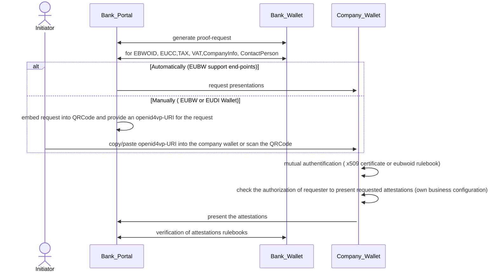

### 1.4. Initiator Authorization

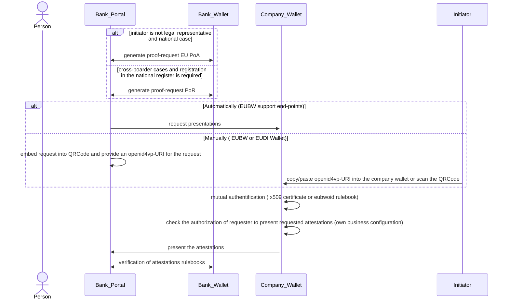

### 1.5. Additionally KYC information

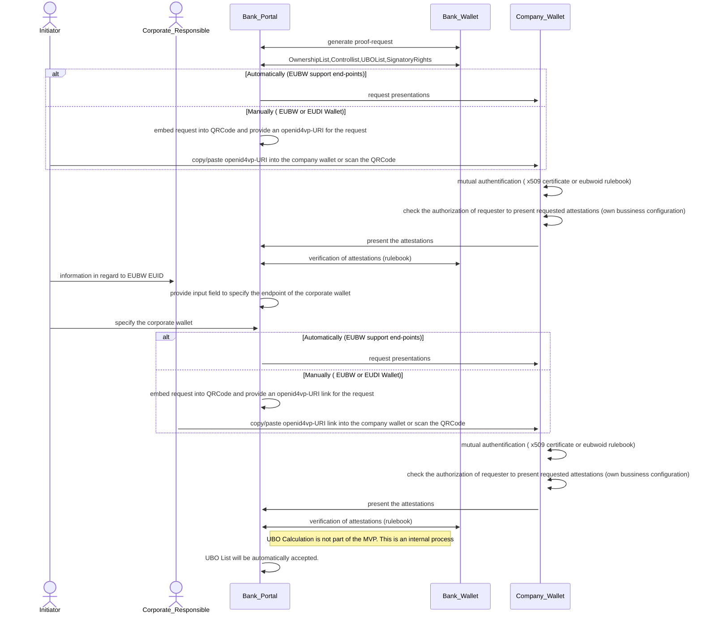

### 1.6. UBOList from Transparency Register

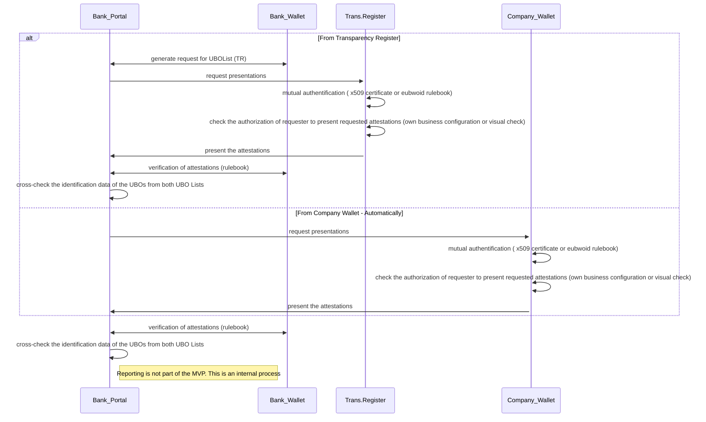

### 1.7. UBOs Verification
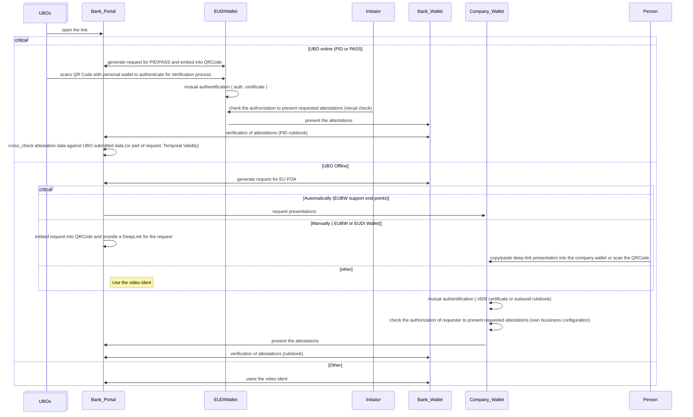

### 1.8. Sanction check 

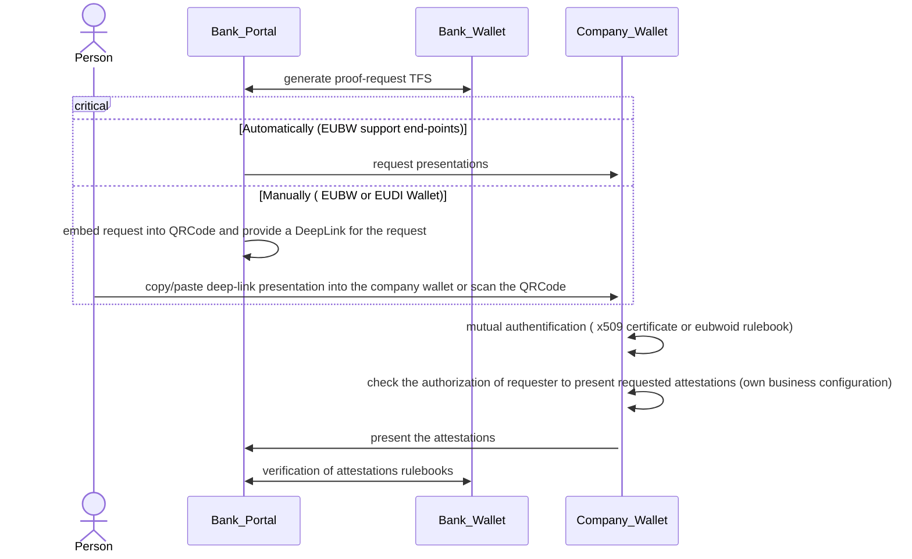

### 1.9. Cross-Check
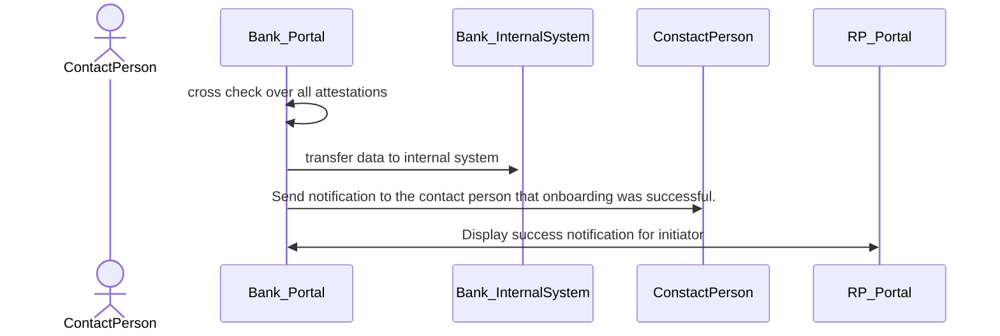

### 2. Scenario 2

### 2.1. Contract signing

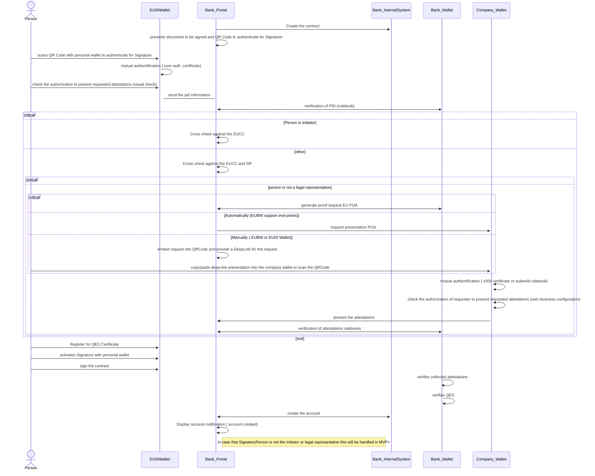

### 3. Scenario 3

### 3.1. Onboarding process (this will be handled in the MVP+)

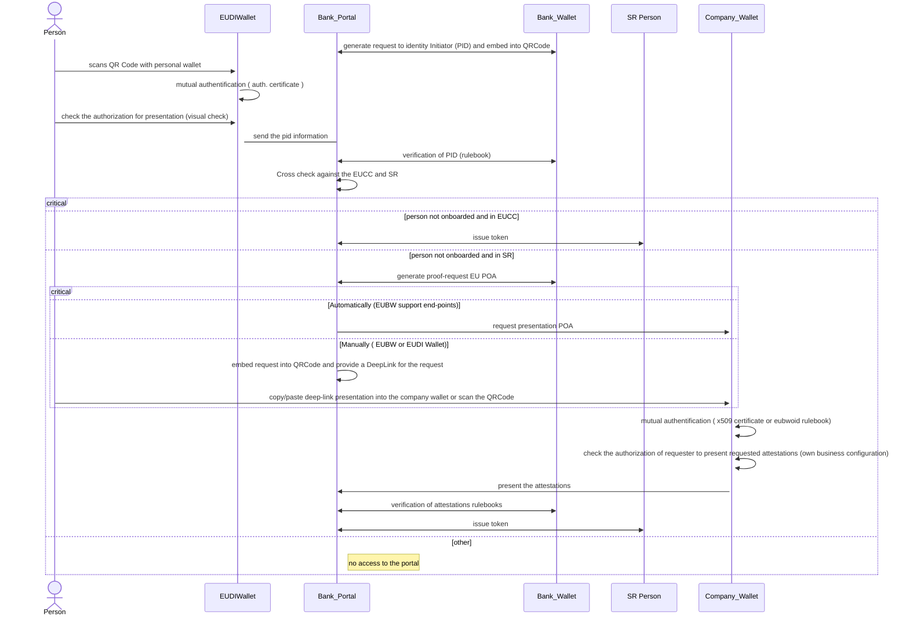

### 3.2. IBAN Issuing

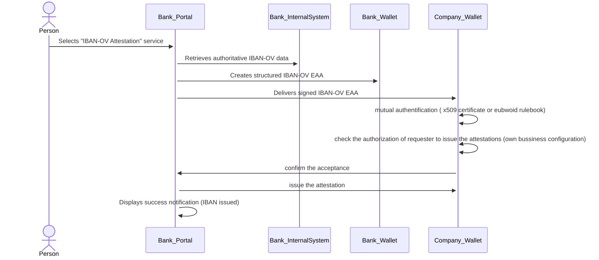
